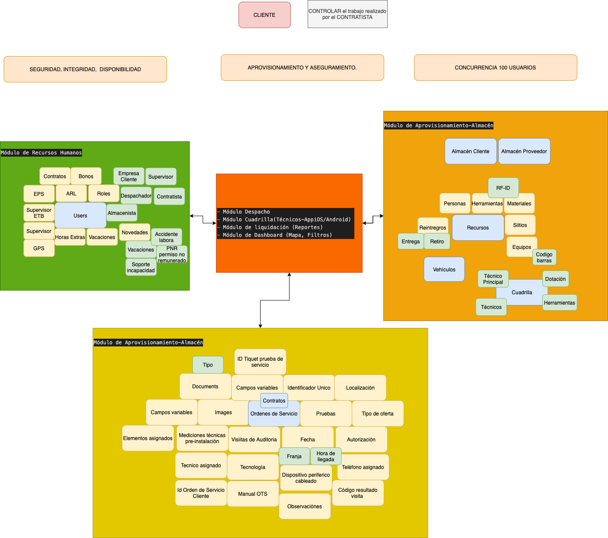

# References
https://www.comparasoftware.com/sinco-erp/
https://www.ticportal.es/temas/software-gestion-recursos-humanos/precio-software-recursos-humanos
https://betterproposals.io/template/index.php?ProposalID=E1BUYOCrMigoYK2-DIbvBBLbhf4tViF1o-v-hFgIO0k&cat=sales
https://www.goprospero.com/saas-sales-proposal-template/
https://templates.proposify.com/proposal-template/saas/1527049
https://www.segurosbonanza.co/cotizador.php?mod=2

- 

# Introducción
Quieren que sus clientes y ustedes tengan un control sobre las Ordenes de Servicio mensualmente y los servicios transversales que lo soportan. Por ésta razón vamos a proveeder un conjunto de ERPs (Modulos) y aplicación movil con el fin de ordenar, facilitar y simplificar los procesos involucrados. Ademas de crecer continuamente juntos.

# Siglas

- ERP (Enterprise resource planning): La planificación de recursos empresariales es la gestión integrada de los principales procesos comerciales, a menudo en tiempo real y mediada por software y tecnología.
- Scrum es un proceso en el que se aplican de manera regular un conjunto de buenas prácticas para trabajar colaborativamente, en equipo, y obtener el mejor resultado posible de un proyecto

# Our team

- Rosalba Gómez
- Arturo Gómez
- Robin Ochoa

# Porque nosotros

Company Name is the best in the business, but we want to share why we think we’re the best fit for you specifically.

1. Our team has developed their expertise over [x] years, with a specialty in [specific problem].
2. Our portfolio contains [x] number of examples of customers who have seen positive results from working with us. [Link to portfolio]. In addition, you can see positive reviews of [our software] [here], [here], and [here]. All of these customers had needs similar to yours.
3. We aim to excel. If you’re not happy after [x] amount of time, a full refund will be available to you.

# Que obtendrás

Con el fin de tener una clasificación clara de los ERPs o Modulos principales que serán implementados y así mismo el licenciamiento para cada uno tendríamos:

1. Módulo de Recursos Humanos
2. Módulo de Ordenes de Servicio
3. Módulo de Aprovisionamiento-Almacén (herramientas, materiales, equipos, dotacioón, sub-almacenes, reintregos) 
4. Módulo Despacho
5. Módulo Cuadrilla(Técnicos-AppiOS/Android) 
6. Módulo de liquidación (Reportes)
7. Módulo de Dashboard (Mapa, Filtros)

# Investment (Pricing-Plans)

## Opción 1:

El proyecto se ejecutará en el transcurso de 6 meses, después de la aceptación del producto se hará un nuevo acuerdo donde se estipulará el cobro por orden de servicio creada, ésto quiere decir que dependiendo de ése número se harán los cargos mensuales. 

### Incluye
- Desarrollo e integración de los siete Modulos
- Arquitecto Software tiempo completo los primeros 4 meses, luego dedicación parcial según las necesidades del proyecto
- Experto Ux/UI 4 meses
- Ingeniero dedicado los primeros 4 meses 
- Soporte horas oficina (lunes a viernes)
- Paquete (peso 8) nuevas funcionalidades a partir de la entrega y aceptacion del proyecto
- Poliza de incumplimiento

### No incluye
- [RO] Poliza de incumplimiento
- [RO] Ux/Uil lo hacemos nosotros con plantilla

### Pago Inicial: 
$20M

### Pago Mensual
- Mes 1:    8.3M
- Mes 2:    8.3M
- Mes 3:    8.3M
- Mes 4:    8.3M
- Mes 5:    8.3M
- Mes 5:    8.3M

## Opción 2:

### Incluye

### No incluye
- [RO] Poliza de incumplimiento
- [RO] Ux/Uil lo hacemos nosotros con plantilla

# Servicios

A continuación se muestra la lista de servicios incluidos con el proyecto. ¿Ves algo que falta o quieres agregar algo a la lista de servicios? Póngase en contacto con nosotros lo antes posible y lo agregaremos de inmediato.

- Entrenamiento [$0]
- Manual / Documentación [$0]
- Soporte       [price]

TOTAL           [price]

# Hitos

Nos gusta mantenerte actualizado. Una vez que se llegue a un acuerdo, programaremos reuniones para asegurarnos de que el software funcione para usted. A continuación se muestra la lista de hitos que mantenemos para el uso estándar dentro de la metodología SCRUM, aunque si desea realizar cambios o agregar hitos, contáctenos.

- Reunión Inicial
- Reunión áreas de interés para la definicion de Ux/UI (2 semanas)
- Entrega de wireframes
- Entrega prototipo funcional
- Entrenamiento, (1 semana)
- Pruebas de aceptación, (1 semana)

## Hitos recurrentes (quincenal)

- Definición Sprint (nuevas funcionalidades, incidentes)
- Reunión funcionalidaddes
- Pruebas antes de reunión y reportes de incidentes

# How We Work

# Next Steps
Let’s talk about next steps. Since we’ve agreed on the project, the first thing you need is how to get in contact with us! So if you have any questions or concerns, please reach out to [phone number] or [email address]. If we can’t answer right away, rest assured that we’ll get back to you within one business day.

When this agreement is completed and signed, our first order of business will be to schedule a time to sit down together and talk. We’ll discuss the problems you’ve been having, any needs you may have, and how [SaaS Solution] can help meet your needs.

Work begins as soon as the first payment is cleared. We can’t wait to get started!

# Terms
1. Payment structure will be via credit card or PayPal. Monthly subscription based, no strings attached.
2. Any information received by the client will be subject to a confidentiality agreement.
3. All original documents obtained from the client will remain the sole property of the client. All documents obtained by the client from [Our Company] will remain the property of [Our Company.]
4. The software license for [SaaS Solution] will terminate when the agreement terminates.
5. [Our Company] retains all intellectual property rights to the software we provide.
6. [Our Company] will provide training in the use of the software, and IT support for the product for [x] months.
7. Any work requested outside of or resulting from this project will be subject to a separate evaluation, analysis, and invoicing.
8. In the case of project cancellation, the client agrees to pay for all work hours already completed.

# SINCO ERP

## ERP
- Ventas
- Gestión de proyectos
- Contabilidad
- Recursos humanos
- Dashboard
- Gestion de actividades empresariales

## Paises
- Colombia
- 
## Lenguaje
- Español

## Soporte Técnico
- Telefónico [x]
- Correo [x]
- Chat
- 24x7
- Horas laborales

## Entrenamiento y capacitación
- Manual / Documentación [X]
- Foro de ayuda
- Webinar / Videos
- Entrenamiento en línea personal [x]

## Despliegue
- Nube, SaaS, Web [x]
- Instalado - Windows [x]
- Instalado - Mac [x]
- Instalado - Linux
- Dispositivo móvil - iOS Nativo
- Dispositivo móvil - Android Nativo

# Modelo de Precios	
- Prueba Gratuita [x]
- Versión de gratuita
- Pago mensual
- Pago anual
- Pago de única vez